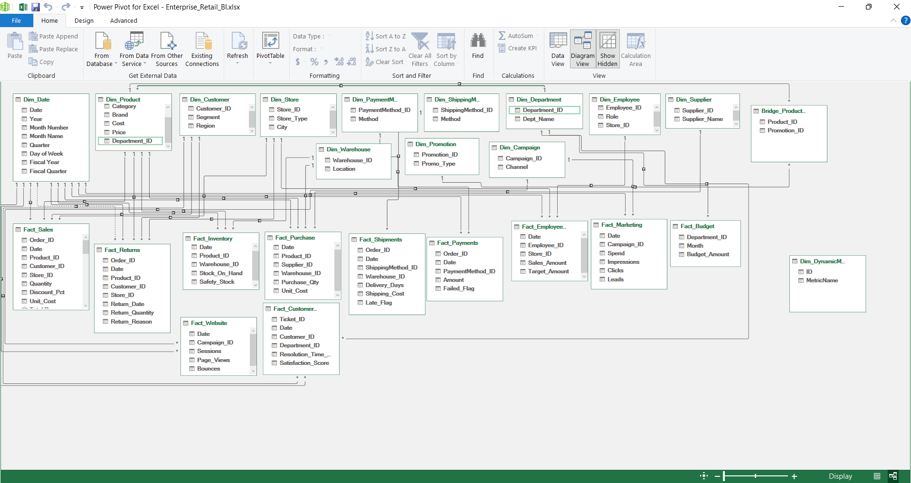
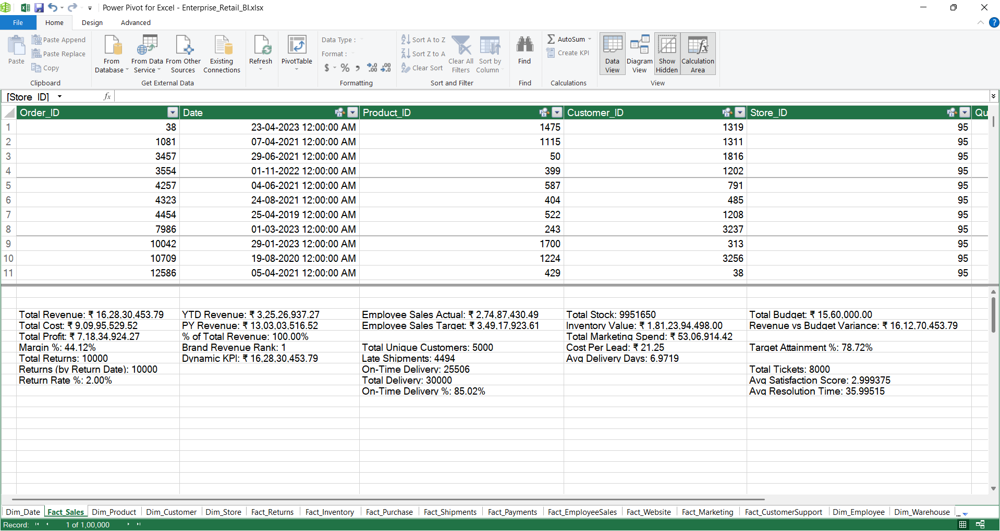
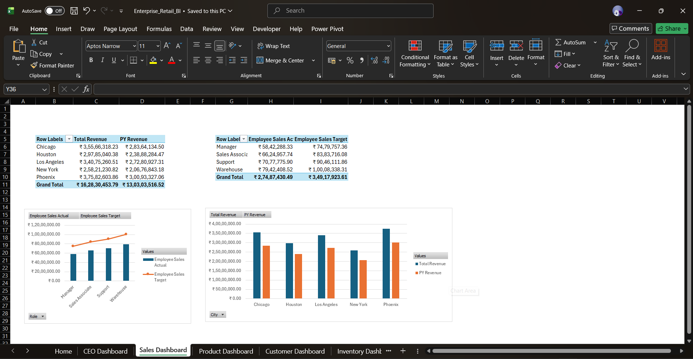
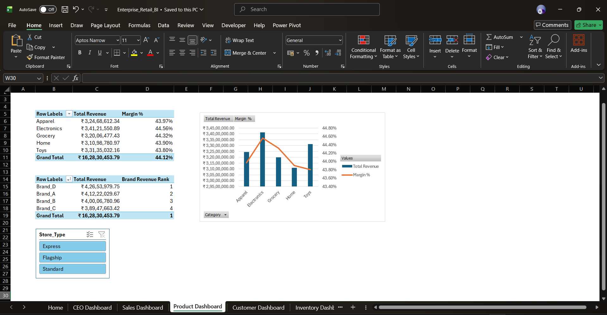
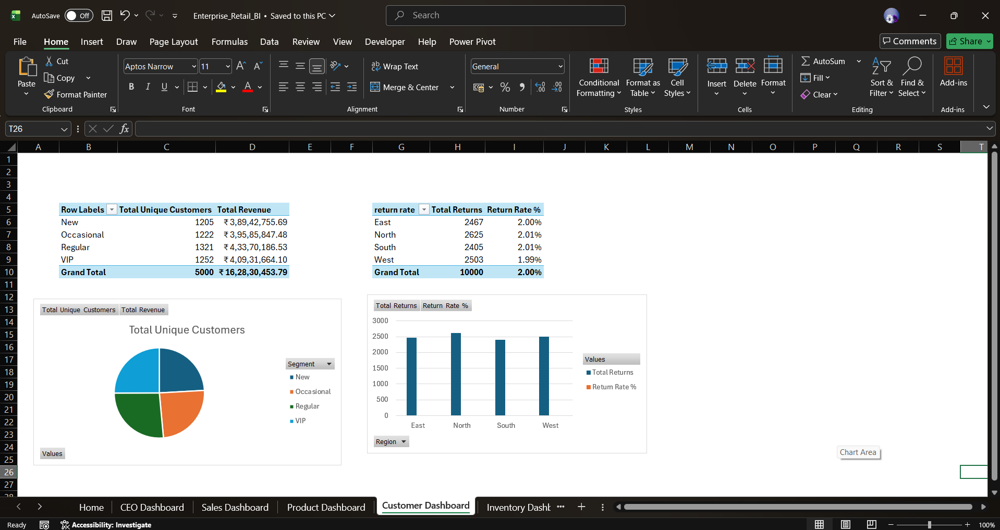

# Enterprise Retail Analytics – Excel & Power Pivot BI Project

## Project Overview

**Enterprise Retail Analytics** is an end-to-end Business Intelligence portfolio project built primarily in **Microsoft Excel**, using Power Query, Power Pivot, DAX, PivotTables, PivotCharts, and Python-generated synthetic retail data.

The project was designed to simulate a multi-functional retail analytics environment rather than a single-dashboard exercise. The analytical model brings together data from sales, customers, products, inventory, purchasing, returns, shipments, payments, marketing, website activity, employee performance, customer support, and departmental budgeting.

The project covers the complete BI workflow:

**Python Data Generation → Power Query ETL → Data Modelling → DAX → Dashboard Development → Validation → Troubleshooting → Model Correction**

The primary sales dataset contains approximately **100,000 transactions**, supported by multiple additional fact and dimension datasets covering the period **2019–2023**.

> **Data Disclaimer:** All data in this project is synthetically generated for learning and portfolio purposes. It does not represent any real company, customer, employee, or financial information.

---

## Technology Stack

| Technology | Application |
|---|---|
| **Microsoft Excel** | Reporting interface, PivotTables, PivotCharts and dashboards |
| **Power Query** | Data import, cleaning, transformation and ETL |
| **Power Pivot** | Relational Data Model and relationship management |
| **DAX** | Measures, KPIs, time intelligence and analytical calculations |
| **M Language** | Power Query transformations and model corrections |
| **Python** | Synthetic data generation with Pandas and NumPy |
| **Git / GitHub** | Version control and portfolio documentation |

---

## Dataset

The source data was generated using two Python scripts and stored as CSV files before being imported and transformed in Power Query.

The project contains **22 source CSV files** covering multiple areas of the retail business.

### Dimension Tables

- `Dim_Campaign`
- `Dim_Customer`
- `Dim_Date`
- `Dim_Department`
- `Dim_Employee`
- `Dim_PaymentMethod`
- `Dim_Product`
- `Dim_Promotion`
- `Dim_ShippingMethod`
- `Dim_Store`
- `Dim_Supplier`
- `Dim_Warehouse`

### Fact Tables

- `Fact_CustomerSupport`
- `Fact_EmployeeSales`
- `Fact_Inventory`
- `Fact_Marketing`
- `Fact_Payments`
- `Fact_Purchase`
- `Fact_Returns`
- `Fact_Sales`
- `Fact_Shipments`
- `Fact_Website`

Additional tables and transformations, including budget-related and helper structures, were created during the Power Query / Data Model development process.

The Python source scripts used to generate the original synthetic dataset are included under:

```text
data_generation_scripts/
├── part-1.py
└── part-2.py
```

Keeping the original generation scripts also preserves the development history of the project. Some data-quality and modelling issues were discovered only after the data was loaded and analysed, requiring investigation and correction later in the BI workflow.

---

# Data Preparation with Power Query

Power Query was used as the ETL layer between the CSV source files and the Excel Data Model.

The work included:

- Importing multiple CSV datasets
- Assigning and correcting data types
- Cleaning source data
- Creating connection-only queries
- Merge operations
- Append operations
- Duplicate handling
- Unpivoting data
- Creating reusable parameters
- Preparing tables for relationships
- Correcting data-quality issues identified during validation

### Merge

Power Query Merge was used to combine related information from different tables, similar to a relational database `JOIN`.

This allowed transactional data to be enriched with attributes required for subsequent analysis.

### Unpivot

Budget data provided an example of why analytical datasets often need to be reshaped.

A structure such as:

```text
Department_ID | Jan | Feb | Mar
```

was transformed into:

```text
Department_ID | Month | Budget_Amount
```

This produces a structure that is considerably easier to aggregate, filter, and analyse.

### Append

Append was explored as a controlled demonstration of vertically combining similarly structured datasets, comparable to a SQL `UNION`.

The exercise also demonstrated an important data-quality consideration: appending duplicate datasets without validation artificially increases totals. Duplicate records were therefore identified and removed during the exercise.

### Dynamic File Path

A Power Query `FolderPath` parameter was created to demonstrate a more maintainable approach to source locations rather than relying entirely on hardcoded paths.

---

# Power Pivot Data Model

The transformed datasets were loaded into **Power Pivot**, where relationships were created between fact and dimension tables.

The model primarily follows one-to-many dimensional modelling principles:

```text
Dimension (1)
      ↓
Fact (*)
```

Examples include Product → Sales, Customer → Sales, Store → Sales, and Date → transactional fact tables.

The model also explores more advanced relationship scenarios including:

- Multiple fact tables sharing dimensions
- Active and inactive date relationships
- Many-to-many resolution through a bridge table
- A disconnected helper table for dynamic KPI selection
- Cross-table filter propagation

## Data Model



---

# DAX Analytical Layer

A reusable analytical layer was created using explicit **DAX measures** rather than relying solely on basic PivotTable aggregations.

The project contains measures covering several business areas.

### Sales & Profitability

- Total Revenue
- Total Cost
- Total Profit
- Margin %
- Total Quantity Sold
- Total Unique Customers

### Returns

- Total Returns
- Returns by Return Date
- Return Rate %

### Time Intelligence

- YTD Revenue
- Previous Year Revenue

### Product Analysis

- % of Total Revenue
- Product Revenue Rank

### Employee Performance

- Employee Sales Actual
- Employee Sales Target
- Target Attainment %

### Logistics

- Total Deliveries
- Late Shipments
- On-Time Delivery %
- Average Delivery Days

### Inventory

- Total Stock
- Inventory Value

### Marketing

- Total Marketing Spend
- Cost Per Lead

### Finance

- Total Budget
- Revenue vs Budget Variance

### Customer Support

- Total Tickets
- Average Satisfaction Score
- Average Resolution Time

The analytical layer required functions and concepts including:

`SUM`, `SUMX`, `DIVIDE`, `CALCULATE`, `DISTINCTCOUNT`, `AVERAGE`, `RANKX`, `ALLSELECTED`, `USERELATIONSHIP`, filter context and time intelligence.

## Example: Inactive Relationship

Returns need to be analysed differently depending on the business question.

A sale has an original Sale Date, while a returned product has a separate Return Date.

An inactive relationship was therefore activated inside a measure when analysis needed to use the physical Return Date:

```DAX
Returns (by Return Date) :=
CALCULATE(
    [Total Returns],
    USERELATIONSHIP(
        Fact_Returns[Return_Date],
        Dim_Date[Date]
    )
)
```

This allows the Date dimension to support multiple date-based analytical perspectives.

## DAX Measures



---

# Data Quality & Model Validation

A major part of this project involved validating whether dashboard results were logically correct rather than assuming that a successful PivotTable or DAX calculation was accurate.

One of the most useful examples occurred while developing the **Finance Dashboard**.

## Problem 1: Identical Revenue Across Departments

The Finance analysis used:

```text
Dim_Department[Dept_Name]

Total Revenue
Total Budget
Revenue vs Budget Variance
```

During validation, every department initially displayed the **same Total Revenue**.

Budget values changed by department, but revenue did not.

This immediately indicated that the issue was not simply the DAX calculation.

### Investigation

The relationship structure was inspected to determine how the Department filter travelled through the model.

`Dim_Department` could filter the budget data, explaining why departmental budgets behaved correctly.

However, Department did not initially have the necessary filter path to the Product/Sales side of the model.

As a result, each department row returned overall company revenue.

### Resolution

The department/category structure was aligned so that the required filter path could operate:

```text
Dim_Department
       ↓
Dim_Product
       ↓
Fact_Sales
```

After refreshing the Data Model, departmental revenue correctly differed between categories.

---

## Problem 2: Missing Toys Department

The relationship investigation exposed another data-quality issue.

The Product data contained five categories:

```text
Electronics
Apparel
Home
Grocery
Toys
```

However, the Department dimension initially contained only:

```text
Electronics
Apparel
Home
Grocery
```

There was no department record corresponding to **Toys**.

### Resolution

The Department transformation was updated to introduce:

```text
Department_ID = 5
Dept_Name     = Toys
```

This allowed the Product and Department structures to be aligned correctly.

---

## Problem 3: Toys Revenue Worked, but Budget Was Missing

After correcting the department structure and relationships, Toys correctly displayed its revenue.

However, its budget was blank.

That indicated a separate problem in the budget data.

### Root Cause

The budget source contained records only for:

```text
Department_ID 1–4
```

The newly recognised:

```text
Department_ID 5 – Toys
```

therefore had no budget allocation.

### Resolution

The Power Query/M transformation for the budget data was updated to include Department 5 and its corresponding monthly budget values.

The model was refreshed and validated again.

The final Finance analysis correctly produced:

- Department-specific revenue
- Department-specific budgets
- Toys revenue and budget
- Revenue vs Budget variance
- Correctly evaluated totals

### What This Demonstrated

This troubleshooting process required more than writing formulas. It involved:

- Detecting unexpected analytical results
- Validating DAX output
- Inspecting model relationships
- Understanding filter propagation
- Tracing problems back to source/dimension data
- Correcting Power Query transformations
- Updating dimensional relationships
- Refreshing and revalidating the model

This validation cycle became one of the most important parts of the project.

---

# Dashboard Development

The final Excel workbook contains a home page and multiple analytical dashboard/report pages covering different areas of the retail business.

The dashboards use combinations of:

- KPI cards
- PivotTables
- PivotCharts
- Slicers
- Ranking
- Variance analysis
- Time-based analysis
- Interactive filtering

The reporting areas include executive-level performance, sales, products, inventory/operations, marketing, finance, employee performance and customer service.

## Dashboard Preview







Additional dashboard pages are available in the `imgs/` directory and in the complete Excel workbook.

---

# Project Structure

```text
Enterprise-Retail-BI-Portfolio/
│
├── Enterprise_Retail_BI.xlsx
│
├── README.md
├── LICENSE
│
├── Dataset/
│   ├── Dim_Campaign.csv
│   ├── Dim_Customer.csv
│   ├── Dim_Date.csv
│   ├── Dim_Department.csv
│   ├── Dim_Employee.csv
│   ├── Dim_PaymentMethod.csv
│   ├── Dim_Product.csv
│   ├── Dim_Promotion.csv
│   ├── Dim_ShippingMethod.csv
│   ├── Dim_Store.csv
│   ├── Dim_Supplier.csv
│   ├── Dim_Warehouse.csv
│   ├── Fact_CustomerSupport.csv
│   ├── Fact_EmployeeSales.csv
│   ├── Fact_Inventory.csv
│   ├── Fact_Marketing.csv
│   ├── Fact_Payments.csv
│   ├── Fact_Purchase.csv
│   ├── Fact_Returns.csv
│   ├── Fact_Sales.csv
│   ├── Fact_Shipments.csv
│   └── Fact_Website.csv
│
├── data_generation_scripts/
│   ├── part-1.py
│   └── part-2.py
│
└── imgs/
    ├── Home_Page.png
    ├── Dashboard_Page_1.png
    ├── Dashboard_Page_2.png
    ├── Dashboard_Page_3.png
    ├── Dashboard_Page_4.png
    ├── Dashboard_Page_5.png
    ├── Dashboard_Page_6.png
    ├── Dashboard_Page_7.png
    ├── Dashboard_Page_8.png
    ├── Dashboard_Page_9.png
    ├── Dashboard_Page_10.png
    ├── data_model_relationships.png
    └── dax_measures.png
```

---

# Skills Demonstrated

- Microsoft Excel analytics
- Power Query ETL
- Power Pivot
- DAX
- Dimensional modelling
- Fact and dimension modelling
- Relationship management
- Active/inactive relationships
- Bridge tables
- Filter context
- Time intelligence
- Data transformation
- Data validation
- Root-cause analysis
- BI troubleshooting
- KPI development
- Dashboard development
- Business analysis
- Python data generation
- Git and GitHub

---

# Key Takeaway

This project reinforced an important BI principle:

> **A calculation can be syntactically correct while the analytical result is still wrong.**

The Finance Dashboard demonstrated this clearly. The original DAX measure was not the primary problem; the incorrect result was caused by the way department filters interacted with the model and by missing dimensional/budget data.

The issue could only be resolved by tracing the complete analytical pipeline from the dashboard back through DAX, relationships, dimensions and source transformations.

The overall development process therefore became:

**Generate → Transform → Model → Calculate → Visualise → Validate → Investigate → Correct → Revalidate**

That end-to-end process represents the central focus of this project.
